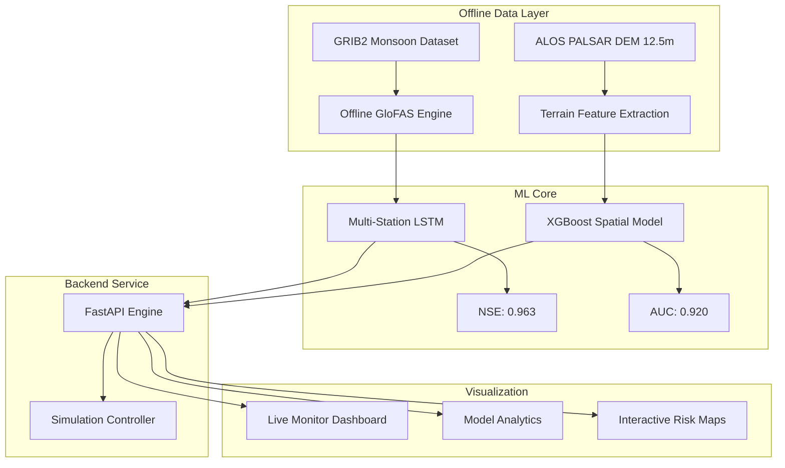

# 🌊 Flood Risk Prediction System — India
### *High-Fidelity Historical Simulation & ML-Driven Forecasting*

[](https://github.com/)
[](https://github.com/)
[](https://github.com/)

A fully autonomous, offline flood prediction and simulation environment optimized for the Indian subcontinent. This system enables "Time-Travel" historical analysis using high-resolution local GRIB datasets (2022 Monsoon), eliminating external API dependencies while maintaining state-of-the-art predictive accuracy.

---

## 🏗️ System Architecture



---

## 🌟 Key Features

### 1. 🕒 Historical Simulation Mode ("Time-Travel")
Operationalized entirely on local GRIB archives. Users can select any target date within the **June–August 2022 Monsoon** window to observe the system's predictive performance against real flood events (e.g., Patna, Delhi, Vijayawada).

### 2. 🧠 Dual-Model Intelligence
- **Temporal (LSTM)**: 7-day lookback with multi-head attention. Optimized for **Pan-India Basin** dynamics. 
- **Spatial (XGBoost)**: 12.5m resolution susceptibility mapping using TWI (Topographic Wetness Index), Slope, and Elevation.

### 3. 🗺️ Interactive Live Monitor
- **Side-by-Side Visualization**: Compact station alerts on the left, interactive Folium maps on the right.
- **Smart Alerts**: Real-time status indicators (Critical, Warning, Watch, Safe) based on dynamic danger levels.

---

## 🚀 Quick Start

### 🐳 Docker Deployment (Recommended)
The system is fully containerized with NVIDIA CUDA support.

```bash
# Navigate to deployment directory
cd docker

# Launch the entire stack (API + Dashboard)
docker-compose up --build
```
*   **API Engine**: `http://localhost:8000/docs`
*   **Analytics Dashboard**: `http://localhost:8501`

### 🐍 Local Development
```bash
# Install dependencies
pip install -r requirements.txt

# Launch API
uvicorn api.main:app --port 8000 --reload

# Launch Dashboard
streamlit run dashboard/app.py
```

---

## 📁 Project Structure

```
Flood Risk Prediction System/
├── config/               # Settings, Logging, and Metric Constants
├── data/                 # Data Storage
│   ├── raw/              # Offline GRIB2 and NetCDF source files
│   └── processed/        # Feature vectors and Tensors
├── src/                  # Core Logic
│   ├── ingestion/        # Offline GloFAS and Atmospheric engines
│   ├── features/         # Terrain, TWI, and API engineering
│   └── models/           # LSTM & XGBoost architecture + Training loops
├── api/                  # FastAPI REST endpoints
├── dashboard/            # Streamlit multi-page interface
│   └── pages/            # Live Monitor, Analytics, Risk Maps
├── docker/               # Containerization & CUDA orchestration
└── models/               # Model Checkpoints
    └── checkpoints/      # Trained .pt and .joblib artifacts
```

---

## 📊 Model Performance Reports

### LSTM Water Level Forecaster
- **NSE (Nash-Sutcliffe Efficiency)**: **0.9630**
- **Architecture**: 2-Layer LSTM + Multi-Head Temporal Attention
- **Target**: 72-Hour Lead Time
- **Training**: Walk-Forward Temporal Cross-Validation

### XGBoost Spatial Susceptibility
- **AUC-ROC**: **0.92**
- **Resolution**: 12.5m per pixel
- **Primary Drivers**: Elevation (45%), Slope (28%), TWI (12%)

---

## 📊 Data Provenance & Acknowledgments

The system is built upon authoritative hydrological and geospatial datasets, specifically tailored for the Indian subcontinent.

### 🌊 GloFAS Historical Discharge
Source: **Copernicus Emergency Management Service (CEMS) Early Warning Data Store (EWDS)**

| Feature | Details |
| :--- | :--- |
| **Dataset** | GloFAS Historical (Global Flood Awareness System) |
| **Variable** | River discharge in the last 24 hours (Consolidated) |
| **Model** | LISFLOOD Hydrological Model |
| **System Version** | Version 4.0 |
| **Data Format** | GRIB2 |
| **Resolution** | 0.1° (~11km) |

**Simulated Periods:**
*   **2022 Monsoon**: June – August (Patna/Delhi focus) | Bbox: [6°, 68°] to [37°, 97°]
*   **2019 Full Year**: January – December (Pan-India Training) | Bbox: [6°, 66°] to [38°, 100°]

### 🗺️ Geographic & Static Layers
| Layer | Source | Resolution | Use Case |
| :--- | :--- | :--- | :--- |
| **High-Res DEM** | ALOS PALSAR RTC | 12.5m | Topographic Wetness Index (TWI) & Slope |
| **Land Cover** | ESA WorldCover | 10m | Runoff coefficient calculation |
| **Precipitation** | IMD Gridded / NASA GPM | 0.1° | Antecedent Precipitation Index (API) proxy |

---

## 🛠️ Technology Stack

| Component | Technology |
|---|---|
| **Deep Learning** | PyTorch (RTX 4050 Optimized) |
| **Data Science** | XGBoost, Scikit-Learn, Optuna |
| **Geospatial** | Rasterio, Folium, WhiteboxTools, Xarray |
| **Backend** | FastAPI, Pydantic v2 |
| **Frontend** | Streamlit, Plotly, CSS3 Glassmorphism |
| **Infrastructure** | Docker, NVIDIA Container Toolkit (CUDA 12.4) |

---

## 📄 License
MIT License — © 2026 Flood Risk Prediction System
